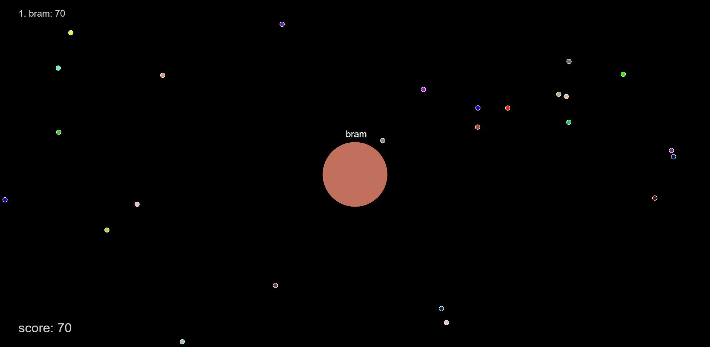

# Agario Clone

*Created in 2017* 
A clone of the popular MMO game [Agar.io](https://agar.io/). 
It is written as a multiplayer server with a login page, the basic game and highscores.

# How to run
To start the server you can run the command `npm start`. 
A server will be started on `http://localhost:3000`. 
You can also build a docker image with the [Dockerfile](./Dockerfile) provided. 
Then you can run the game in a docker container. 
When you first launch the game, no users will be registered. 
On the login page there is a link where you can register users. 
This will create a `users.db` file with the username and passwords (hashed). 
Highscores will be stored in a `highscores.db` file.

# Controls
`mouse` the blob will take the direction your mouse is pointed at. 
`space bar` on pressing this key the blob will split in 2 smaller ones. Depending on the size of your blob it can split multiple times. 
`a` the blob will move automatically to the nearest pieces of food.

